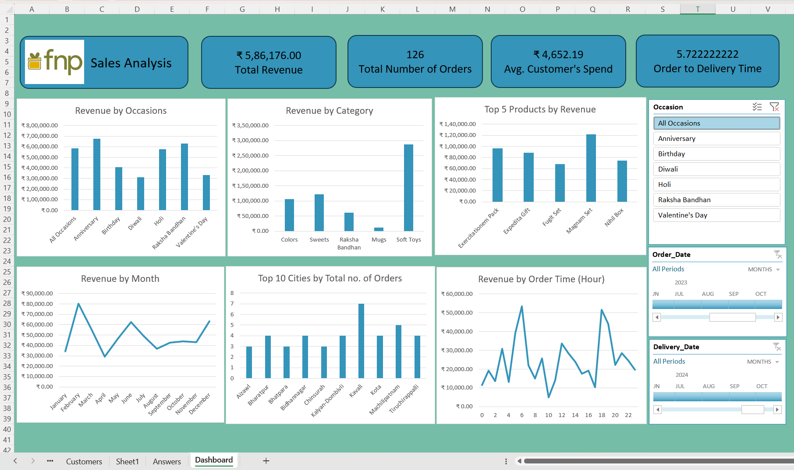

# Ferns and Petals Sales Analysis Dashboard

This project presents a comprehensive sales analysis for Ferns and Petals (FNP), an e-commerce gifting platform. The analysis is built using Microsoft Excel’s advanced features including Power Query, DAX, Data Modeling, and interactive dashboards to uncover critical business insights.

The aim was to evaluate customer behavior, product performance, and sales patterns to help FNP refine its marketing and operational strategies.

## 📸 Dashboard Preview


---

## Problem Statement

Ferns and Petals provided transactional data related to products, customers, orders, and delivery details. The business needed a detailed analysis that answers the following questions:

1. What is the total revenue generated?
2. How long does it typically take for an order to be delivered?
3. What is the monthly trend of revenue in 2023?
4. Which products and categories generate the most revenue?
5. What is the average spending per customer?
6. Which are the top-performing products?
7. Which cities place the highest number of orders?
8. Is there a correlation between order quantity and delivery time?
9. How does revenue vary across different occasions?
10. Which products are most popular for specific occasions?

---

## Data Preparation and Modeling

This project integrates data from three key datasets: `orders.csv`, `customers.csv`, and `products.csv`.

### Power Query Transformations

- Data cleaning: Removed nulls, corrected formats for dates and numeric columns.
- Merging tables:
  - `orders` was merged with `customers` using `CustomerID`.
  - `orders` was merged with `products` using `ProductID`.
- Date extraction:
  - Extracted `Month`, `Year`, and `Hour` from `Order Date` and `Delivery Date`.
  - Created `Order to Delivery Days` column using DAX:
    ```dax
    Order to Delivery Time = DATEDIFF('Orders'[Order Date], 'Orders'[Delivery Date], DAY)
    ```

### Custom Columns and Measures

- **Order Month**:
    ```dax
    Order Month = FORMAT('Orders'[Order Date], "MMMM")
    ```

- **Order Hour**:
    ```dax
    Order Hour = HOUR('Orders'[Order Date])
    ```

- **Total Revenue**:
    ```dax
    Total Revenue = SUM('Orders'[TotalAmount])
    ```

- **Average Customer Spend**:
    ```dax
    Avg Customer Spend = AVERAGEX(VALUES('Customers'[CustomerID]), [Total Revenue per Customer])
    ```

- **Total Orders**:
    ```dax
    Total Orders = DISTINCTCOUNT('Orders'[OrderID])
    ```

- **Revenue Rank (for Top Products)**:
    ```dax
    Revenue Rank = RANKX(ALL('Products'[ProductName]), [Total Revenue], , DESC)
    ```

---

## Dashboard Design and Interactivity

The dashboard was created using Excel's Pivot Charts, Pivot Tables, and Slicers to deliver an interactive experience.

### Key Visuals

1. **Revenue by Occasion**  
   Bar chart showing total revenue across occasions such as Diwali, Valentine's Day, etc.

2. **Revenue by Category**  
   Highlights top-performing product categories such as Soft Toys, Sweets, and Mugs.

3. **Top 5 Products by Revenue**  
   Dynamically displays top-performing products using DAX rank functions.

4. **Revenue by Month (2023)**  
   Line chart visualizing monthly revenue trends. February and December show significant peaks.

5. **Top 10 Cities by Orders**  
   Visualizes cities with the highest order volumes, useful for geo-targeting.

6. **Revenue by Order Hour**  
   Identifies time-of-day patterns in order placements, with peaks between 8–10 AM and 5–6 PM.

7. **Average Delivery Time**  
   Displays the average number of days taken to fulfill an order.

8. **Customer Spending**  
   Shows the average amount each customer spends, based on total revenue and unique customer count.

### Slicer Integration

The dashboard includes dynamic slicers connected across all visuals, allowing for:

- Occasion filtering
- Order Date and Delivery Date filtering
- Interactive drilldowns and real-time updates across the entire report

---

## Key Insights

- **Total Revenue**: ₹5,86,176
- **Total Orders**: 126
- **Average Customer Spend**: ₹4,652.19
- **Average Order to Delivery Time**: 5.72 Days
- **Top Occasion**: Anniversary
- **Top Product Category**: Soft Toys
- **Best Performing Product**: ExoticArrangement Pack
- **Most Active Order Hours**: 8–10 AM and 5–6 PM
- **Top Ordering City**: Kolkata

These insights are instrumental in guiding seasonal promotions, supply chain optimization, customer segmentation, and city-specific marketing campaigns.

---

## Conclusion

This dashboard project for Ferns and Petals demonstrates the practical application of Excel-based analytics using Power Query, DAX, and data modeling to deliver business insights from raw data. The report supports decision-making in marketing, operations, and product strategy through an interactive and user-friendly interface.

---

## Career Objective

I am currently seeking opportunities in the field of Data Analytics. This project exhibits my skills in:

- Microsoft Excel
- Power Query
- DAX (Data Analysis Expressions)
- Data Modeling
- Dashboard Development

